# Vingznime

Vingznime is a catalog website for anime fans, allowing users to keep track of their favorite series.

## Tech Stack

Next.js, Typescript, Prisma, Auth.js, React Hook Form, Formik, Tailwind CSS, Resend Email, Mongodb

## Environment Variables

To run this project, you will need to add the following environment variables to your .env file

`NEXT_PUBLIC_API_BASE_URL=https://api.jikan.moe/v4`

`NEXT_PUBLIC_APP_URL="http://localhost:3000"`

`NEXTAUTH_SECRET=`

`GITHUB_CLIENT_ID=`

`GITHUB_SECRET_SECRET=`

`GOOGLE_CLIENT_ID=`

`GOOGLE_CLIENT_SECRET=`

`DATABASE_URL=`

`RESEND_API_KEY=`

## Run Locally

1. Clone the project

```bash
  git clone https://github.com/tajulsubqi/vingznime.git
```

    add an .env file with the following environment variables

1. Install dependencies

```bash
  npm install
```

4. Generating Prisma Client

```bash
  npx prisma generate
```

5. Start the server

```bash
  npm run dev
```

## Demo

You can see a demo of this project at [https://vingznime.vercel.app/](https://vingznime.vercel.app/).

## Screenshots

<table>
  <tr>
    <td>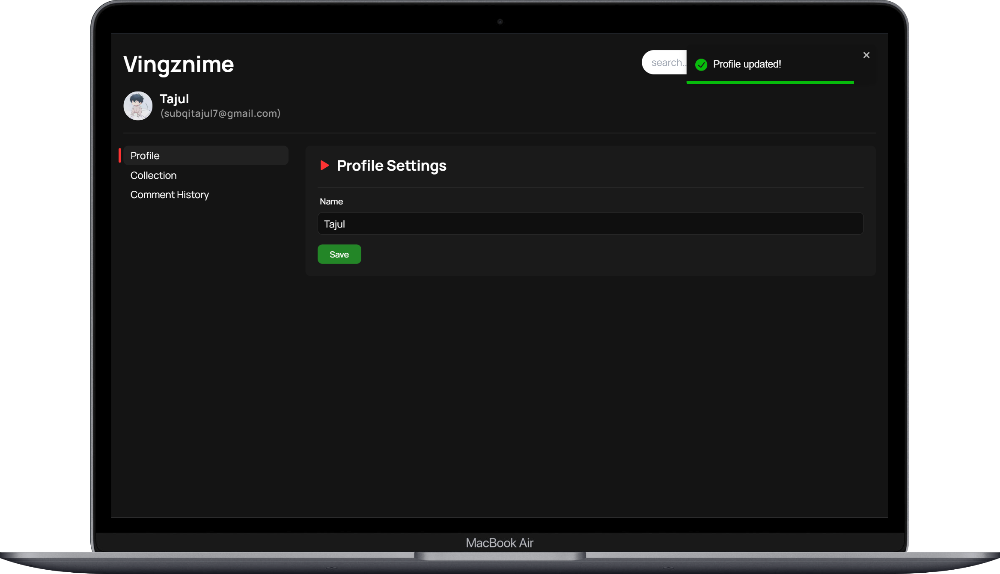</td>
   <td>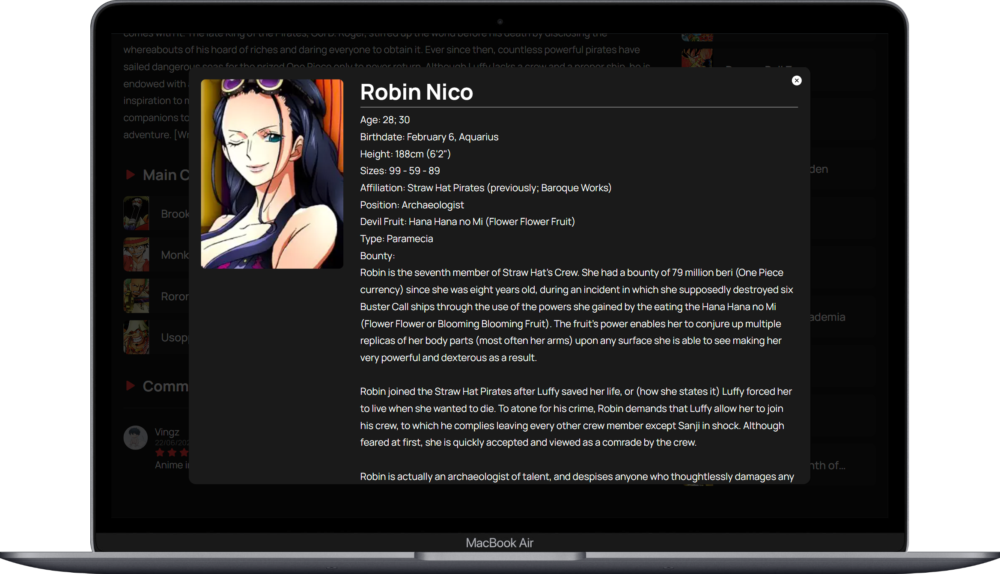</td>
  </tr>
  <tr>
    <td>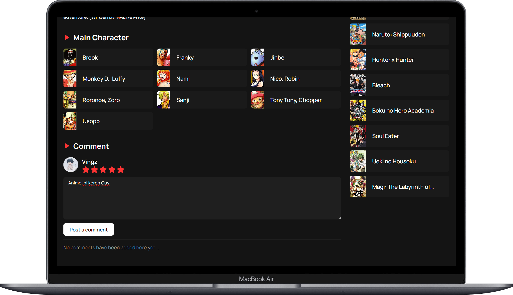</td>
   <td>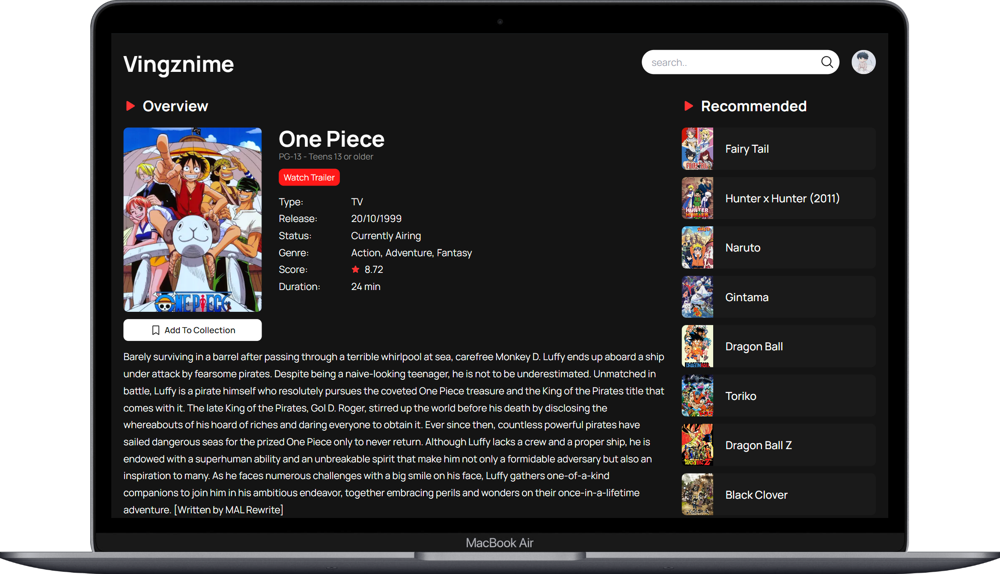</td>
  </tr>
  <tr>
    <td>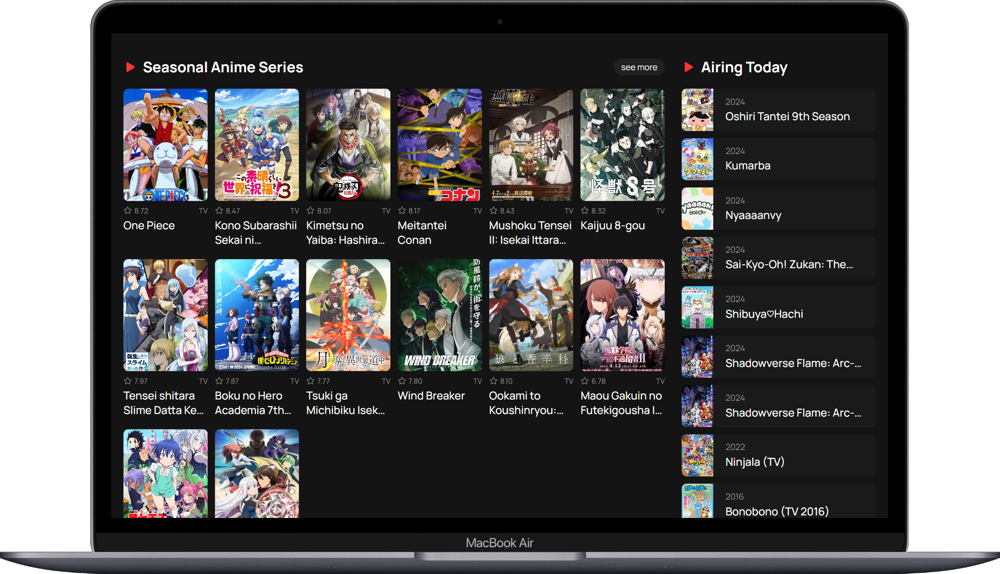</td>
  </tr>

  <tr>
   <td>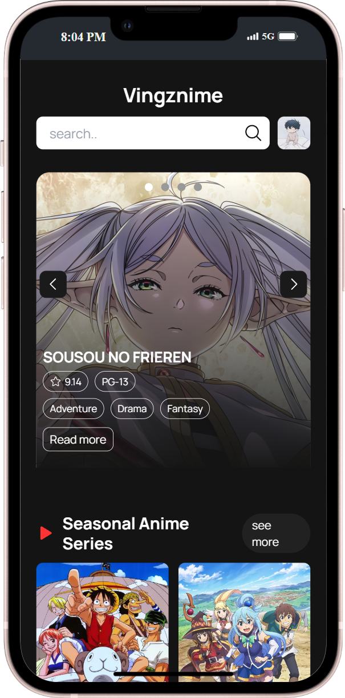</td>
    <td>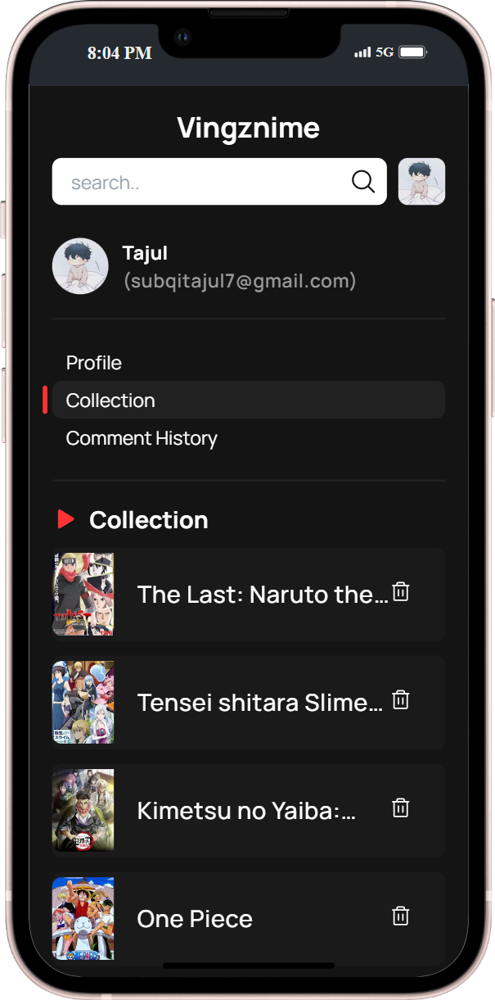</td>
  </tr>
  <tr>
   <td>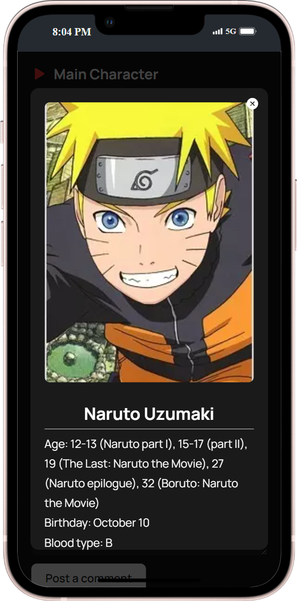</td>
    <td>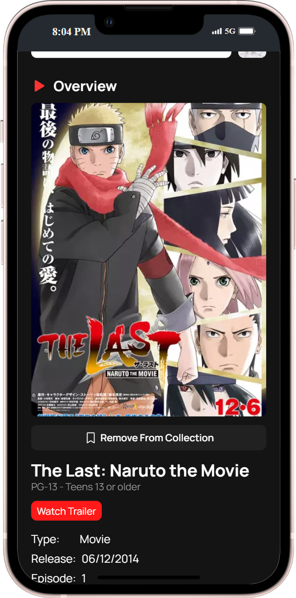</td>
  </tr>
  <tr>
   <td>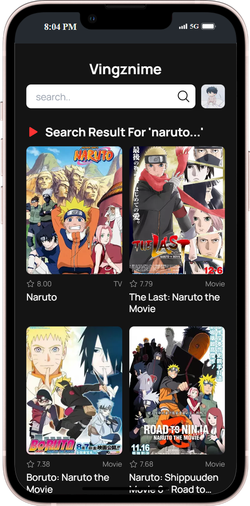</td>
    <td>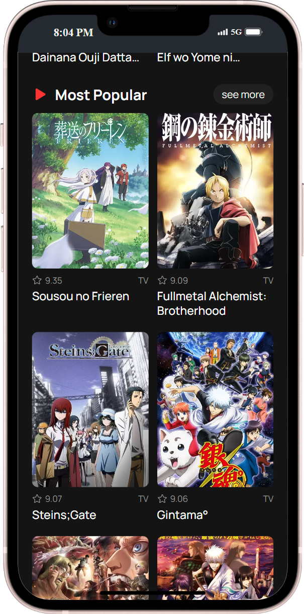</td>
  </tr>

</table>

## Feedback

If you have any feedback, please reach out to us at [subqitajul7@gmail.com](mailto:subqitajul7@gmail.com)

## Authors

- [Tajul Subqi](https://github.com/tajulsubqi)
